# AI will ER図

| 項目 | 内容 |
|------|------|
| ドキュメント名 | AI will ER図 |
| バージョン | 1.0.0 |
| 作成日 | 2026-01-31 |
| 参照元 | entities.md v3.1.8, relationships.md v1.0.2 |

---

## 概要

- **エンティティ数**: 48テーブル（マスタ7 + トランザクション41）
- **1対1リレーション**: 5件
- **1対多リレーション**: 36件
- **多対多（中間テーブル）**: 8件
- **ポリモーフィック参照**: 5件（コメント注記のみ）

---

## ER図

```mermaid
erDiagram
    %% ============================================
    %% 1. マスタデータ（master）
    %% ============================================
    
    m_age_groups {
        uuid id PK
        %% TODO: 他の属性（code, name等）は未定義
    }
    
    m_relationship_stages {
        uuid id PK
        varchar stage_code UK
        %% TODO: 他の属性（name, threshold等）は未定義
    }
    
    m_tags {
        uuid id PK
        %% TODO: 他の属性（name, category等）は未定義
    }
    
    m_report_reasons {
        uuid id PK
        varchar reason_code UK
        %% TODO: 他の属性（label等）は未定義
    }
    
    m_event_types {
        uuid id PK
        %% TODO: 他の属性（type_code, name等）は未定義
    }
    
    m_voice_categories {
        uuid id PK
        varchar category_code UK
        %% TODO: 他の属性（name等）は未定義
    }
    
    m_flag_definitions {
        uuid id PK
        varchar flag_code UK
        %% TODO: 他の属性（description等）は未定義
    }

    %% ============================================
    %% 2.1 ユーザー/アカウント系
    %% ============================================
    
    users {
        uuid id PK
        uuid age_group_id FK
        %% TODO: 他の属性（email, name等）は未定義
    }
    
    creators {
        uuid id PK
        uuid user_id FK
        %% NOT NULL, UNIQUE(user_id)
        %% TODO: 他の属性（display_name等）は未定義
    }
    
    admin_users {
        uuid id PK
        varchar role
        %% TODO: 他の属性（email, name等）は未定義
    }

    %% ============================================
    %% 2.2 キャラクター系
    %% ============================================
    
    characters {
        uuid id PK
        uuid creator_id FK
        %% NOT NULL
        %% relationships.md に基づく
        %% TODO: 他の属性（name, description等）は未定義
    }
    
    character_personalities {
        uuid id PK
        uuid character_id FK
        %% NOT NULL, UNIQUE(character_id) - 1:1
        %% TODO: 他の属性（personality_json等）は未定義
    }

    %% ============================================
    %% 2.3 商品/販売単位系
    %% ============================================
    
    packs {
        uuid id PK
        varchar pack_type
        %% TODO: 他の属性（name, price等）は未定義
    }
    
    pack_items {
        uuid id PK
        uuid pack_id FK
        %% NOT NULL
        varchar item_type
        %% ポリモーフィック
        uuid item_id
        %% ポリモーフィック（FK無し）
    }
    
    character_tags {
        uuid id PK
        uuid character_id FK
        uuid tag_id FK
        %% UNIQUE(character_id, tag_id)
    }
    
    pack_tags {
        uuid id PK
        uuid pack_id FK
        uuid tag_id FK
        %% UNIQUE(pack_id, tag_id)
    }

    %% ============================================
    %% 2.4 フォロー/お気に入り系
    %% ============================================
    
    user_creator_follows {
        uuid id PK
        uuid user_id FK
        uuid creator_id FK
        %% UNIQUE(user_id, creator_id)
    }
    
    user_favorites {
        uuid id PK
        uuid user_id FK
        uuid character_id FK
        %% UNIQUE(user_id, character_id)
    }

    %% ============================================
    %% 2.5 課金/決済系
    %% ============================================
    
    purchases {
        uuid id PK
        uuid user_id FK
        %% NOT NULL
        %% relationships.md に基づく
        varchar payment_provider
        varchar payment_id
        %% UNIQUE(payment_provider, payment_id)
        %% TODO: 他の属性（amount, purchased_at等）は未定義
    }
    
    user_entitlements {
        uuid id PK
        uuid user_id FK
        %% NOT NULL
        varchar entitlement_type
        %% ポリモーフィック
        uuid entitlement_id
        %% ポリモーフィック（FK無し）
        uuid source_purchase_id FK
        %% NULLABLE（無料付与の場合NULL）
        timestamp revoked_at
        %% UNIQUE(user_id, entitlement_type, entitlement_id) WHERE revoked_at IS NULL
    }
    
    user_ticket_balances {
        uuid id PK
        uuid user_id FK
        %% NOT NULL, UNIQUE(user_id)
        %% TODO: balance等は未定義
    }
    
    ticket_transactions {
        uuid id PK
        uuid user_id FK
        %% NOT NULL
        %% relationships.md に基づく
        varchar transaction_type
        %% transaction_type: purchase/consume/refund/grant
        %% TODO: amount等は未定義
    }

    %% ============================================
    %% 2.6 収益分配系
    %% ============================================
    
    payout_accounts {
        uuid id PK
        uuid creator_id FK
        %% NOT NULL
        %% relationships.md に基づく
        boolean is_default
        timestamp deleted_at
        %% TODO: bank_info等は未定義
    }
    
    creator_payouts {
        uuid id PK
        uuid creator_id FK
        %% NOT NULL
        %% relationships.md に基づく
        %% TODO: period, amount等は未定義
    }
    
    payout_line_items {
        uuid id PK
        uuid payout_id FK
        %% NOT NULL
        %% TODO: 他の属性は未定義
    }

    %% ============================================
    %% 2.7 ユーザー×キャラクター関係系
    %% ============================================
    
    user_character_relationships {
        uuid id PK
        uuid user_id FK
        uuid character_id FK
        uuid stage_id FK
        %% NOT NULL
        %% UNIQUE(user_id, character_id)
        %% TODO: affection_points等は未定義
    }
    
    user_character_flags {
        uuid id PK
        uuid user_id FK
        uuid character_id FK
        varchar flag_code FK
        %% NOT NULL
        %% UNIQUE(user_id, character_id, flag_code)
    }
    
    user_character_memories {
        uuid id PK
        uuid user_id FK
        uuid character_id FK
        %% UNIQUE(user_id, character_id)
        %% TODO: nickname, preferences等は未定義
    }
    
    memory_clips {
        uuid id PK
        uuid user_id FK
        %% NOT NULL
        uuid character_id FK
        %% NOT NULL
        uuid source_message_id FK
        %% NULLABLE
        %% TODO: 他の属性は未定義
    }

    %% ============================================
    %% 2.8 音声系
    %% ============================================
    
    voice_packs {
        uuid id PK
        uuid character_id FK
        %% NOT NULL
        %% TODO: 他の属性は未定義
    }
    
    voice_assets {
        uuid id PK
        uuid voice_pack_id FK
        %% NOT NULL
        uuid voice_category_id FK
        %% NOT NULL
        %% TODO: file_url等は未定義
    }
    
    rights_consents {
        uuid id PK
        uuid voice_asset_id FK
        %% NOT NULL, UNIQUE(voice_asset_id) - 1:1
        %% TODO: 他の属性は未定義
    }

    %% ============================================
    %% 2.9 イベント系
    %% ============================================
    
    events {
        uuid id PK
        uuid character_id FK
        %% NOT NULL
        uuid event_type_id FK
        %% NULLABLE（暫定）
        %% TODO: 他の属性（name等）は未定義
    }
    
    event_unlock_conditions {
        uuid id PK
        uuid event_id FK
        %% NOT NULL
        varchar condition_type
        %% condition_type: flag/affection/event_completed
        uuid prerequisite_event_id FK
        %% NULLABLE
        varchar flag_code FK
        %% NULLABLE
        %% 排他CHECK制約あり
    }
    
    event_script_nodes {
        uuid id PK
        uuid event_id FK
        %% NOT NULL
        uuid voice_asset_id FK
        %% NULLABLE
        %% TODO: 他の属性（content, node_type等）は未定義
    }
    
    event_branch_options {
        uuid id PK
        uuid node_id FK
        %% NOT NULL
        uuid next_node_id FK
        %% NULLABLE
        %% TODO: 他の属性（option_text等）は未定義
    }
    
    user_event_completions {
        uuid id PK
        uuid user_id FK
        uuid event_id FK
        %% UNIQUE(user_id, event_id)
    }

    %% ============================================
    %% 2.10 会話系
    %% ============================================
    
    conversation_sessions {
        uuid id PK
        uuid user_id FK
        %% NOT NULL
        uuid character_id FK
        %% NOT NULL
        varchar session_type
        %% session_type: free/event
        uuid event_id FK
        %% NULLABLE
    }
    
    conversation_messages {
        uuid id PK
        uuid session_id FK
        %% NOT NULL
        varchar role
        %% role: user/character
        %% TODO: content, created_at等は未定義
    }

    %% ============================================
    %% 2.11 通報/モデレーション/安全系
    %% ============================================
    
    reports {
        uuid id PK
        uuid reporter_user_id FK
        %% NULLABLE（退会時SET NULL）
        uuid reason_id FK
        %% NOT NULL
        varchar target_type
        %% ポリモーフィック
        uuid target_id
        %% ポリモーフィック（FK無し）
        varchar status
        %% status: open/in_progress/resolved/rejected
    }
    
    moderation_actions {
        uuid id PK
        uuid report_id FK
        %% NULLABLE
        uuid admin_user_id FK
        %% NOT NULL
        varchar action_type
        %% action_type: suspend/restore/warn/ban
    }
    
    appeals {
        uuid id PK
        uuid moderation_action_id FK
        %% NOT NULL, UNIQUE(moderation_action_id)
        %% TODO: 他の属性は未定義
    }
    
    user_blocks {
        uuid id PK
        uuid user_id FK
        varchar target_type
        %% ポリモーフィック
        uuid target_id
        %% ポリモーフィック（FK無し）
        timestamp deleted_at
        %% UNIQUE(user_id, target_type, target_id) WHERE deleted_at IS NULL
    }

    %% ============================================
    %% 2.12 権利/同意系
    %% ============================================
    
    terms_agreements {
        uuid id PK
        varchar actor_type
        %% ポリモーフィック
        uuid actor_id
        %% ポリモーフィック（FK無し）
        varchar terms_type
        varchar terms_version
        %% UNIQUE(actor_type, actor_id, terms_type, terms_version)
    }

    %% ============================================
    %% 2.13 プライバシー系
    %% ============================================
    
    data_deletion_requests {
        uuid id PK
        uuid user_id FK
        %% NOT NULL
        %% relationships.md に基づく
        varchar status
        %% status: requested/processing/completed/rejected
    }
    
    data_export_requests {
        uuid id PK
        uuid user_id FK
        %% NOT NULL
        %% relationships.md に基づく
        varchar status
        %% status: requested/processing/ready/expired
    }

    %% ============================================
    %% 2.14 ログ/通知系
    %% ============================================
    
    audit_logs {
        uuid id PK
        %% 書き込み専用、改ざん防止
        %% FK無し（完全独立・イミュータブル）
        %% TODO: action, actor_id, payload等は未定義
    }
    
    notifications {
        uuid id PK
        uuid user_id FK
        %% NOT NULL
        %% relationships.md に基づく
        %% TODO: content等は未定義
    }

    %% ============================================
    %% リレーションシップ（relationships.md準拠）
    %% ============================================

    %% ------------------------------------------
    %% 1. 1対1リレーション（UNIQUE FKで担保）
    %% ------------------------------------------
    users ||--o| creators : user_id
    characters ||--|| character_personalities : character_id
    voice_assets ||--|| rights_consents : voice_asset_id
    moderation_actions ||--o| appeals : moderation_action_id
    users ||--|| user_ticket_balances : user_id

    %% ------------------------------------------
    %% 2.1 ユーザー/アカウント系（1対多）
    %% ------------------------------------------
    users ||--o{ purchases : user_id
    users ||--o{ user_entitlements : user_id
    users ||--o{ ticket_transactions : user_id
    users ||--o{ conversation_sessions : user_id
    users ||--o{ data_deletion_requests : user_id
    users ||--o{ data_export_requests : user_id
    users o|--o{ reports : reporter_user_id
    users ||--o{ notifications : user_id
    users ||--o{ memory_clips : user_id
    users ||--o{ user_blocks : user_id

    %% ------------------------------------------
    %% 2.2 クリエイター系（1対多）
    %% ------------------------------------------
    creators ||--o{ characters : creator_id
    creators ||--o{ payout_accounts : creator_id
    creators ||--o{ creator_payouts : creator_id

    %% ------------------------------------------
    %% 2.3 キャラクター系（1対多）
    %% ------------------------------------------
    characters ||--o{ events : character_id
    characters ||--o{ voice_packs : character_id
    characters ||--o{ conversation_sessions : character_id
    characters ||--o{ memory_clips : character_id

    %% ------------------------------------------
    %% 2.4 商品/販売系（1対多）
    %% ------------------------------------------
    packs ||--o{ pack_items : pack_id
    purchases o|--o{ user_entitlements : source_purchase_id

    %% ------------------------------------------
    %% 2.5 音声系（1対多）
    %% ------------------------------------------
    voice_packs ||--o{ voice_assets : voice_pack_id
    m_voice_categories ||--o{ voice_assets : voice_category_id

    %% ------------------------------------------
    %% 2.6 イベント系（1対多）
    %% ------------------------------------------
    events ||--o{ event_unlock_conditions : event_id
    events o|--o{ event_unlock_conditions : prerequisite_event_id
    events ||--o{ event_script_nodes : event_id
    events o|--o{ conversation_sessions : event_id
    event_script_nodes ||--o{ event_branch_options : node_id
    event_script_nodes o|--o{ event_branch_options : next_node_id
    voice_assets o|--o{ event_script_nodes : voice_asset_id
    m_event_types o|--o{ events : event_type_id
    m_flag_definitions o|--o{ event_unlock_conditions : flag_code

    %% ------------------------------------------
    %% 2.7 会話系（1対多）
    %% ------------------------------------------
    conversation_sessions ||--o{ conversation_messages : session_id
    conversation_messages o|--o{ memory_clips : source_message_id

    %% ------------------------------------------
    %% 2.8 収益分配系（1対多）
    %% ------------------------------------------
    creator_payouts ||--o{ payout_line_items : payout_id

    %% ------------------------------------------
    %% 2.9 通報/モデレーション系（1対多）
    %% ------------------------------------------
    m_report_reasons ||--o{ reports : reason_id
    reports o|--o{ moderation_actions : report_id
    admin_users ||--o{ moderation_actions : admin_user_id

    %% ------------------------------------------
    %% 2.10 マスタ→トランザクション
    %% ------------------------------------------
    m_relationship_stages ||--o{ user_character_relationships : stage_id
    m_flag_definitions ||--o{ user_character_flags : flag_code
    m_age_groups ||--o{ users : age_group_id

    %% ------------------------------------------
    %% 3. 多対多（中間テーブル経由）
    %% ------------------------------------------
    characters ||--o{ character_tags : character_id
    m_tags ||--o{ character_tags : tag_id
    packs ||--o{ pack_tags : pack_id
    m_tags ||--o{ pack_tags : tag_id
    users ||--o{ user_creator_follows : user_id
    creators ||--o{ user_creator_follows : creator_id
    users ||--o{ user_favorites : user_id
    characters ||--o{ user_favorites : character_id
    users ||--o{ user_character_relationships : user_id
    characters ||--o{ user_character_relationships : character_id
    users ||--o{ user_character_flags : user_id
    characters ||--o{ user_character_flags : character_id
    users ||--o{ user_character_memories : user_id
    characters ||--o{ user_character_memories : character_id
    users ||--o{ user_event_completions : user_id
    events ||--o{ user_event_completions : event_id

    %% ------------------------------------------
    %% 4. ポリモーフィック参照（リレーション線なし）
    %% ------------------------------------------
    %% pack_items.item_type/item_id -> characters / events / voice_packs
    %% user_entitlements.entitlement_type/entitlement_id -> packs等
    %% reports.target_type/target_id -> characters / conversation_messages / creators
    %% user_blocks.target_type/target_id -> users / creators / characters
    %% terms_agreements.actor_type/actor_id -> users / creators / admin_users
```

---

## 凡例

| 記号 | 意味 |
|------|------|
| `\|\|` | exactly one（1つだけ） |
| `o\|` | zero or one（0または1） |
| `o{` | zero or more（0以上） |
| `\|{` | one or more（1以上） |
| `PK` | Primary Key |
| `FK` | Foreign Key |
| `UK` | Unique Key |

---

## 改訂履歴

| バージョン | 日付 | 変更内容 |
|------------|------|----------|
| 1.0.0 | 2026-01-31 | 初版作成 |
