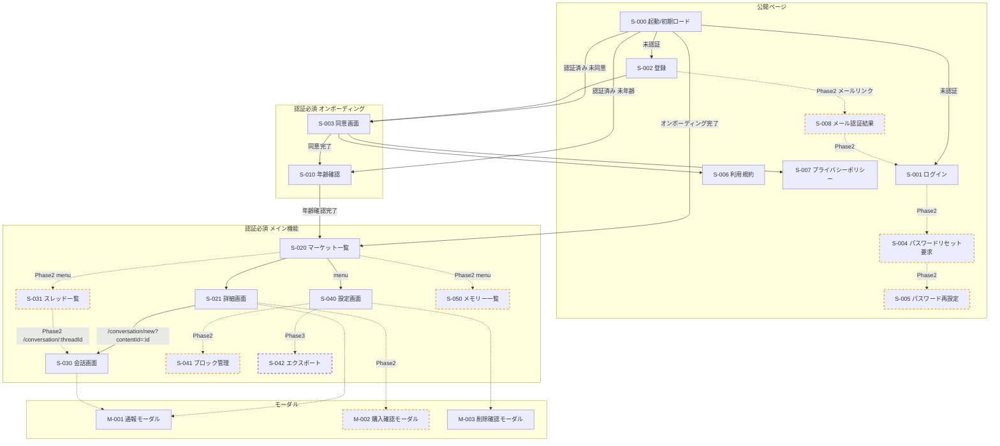
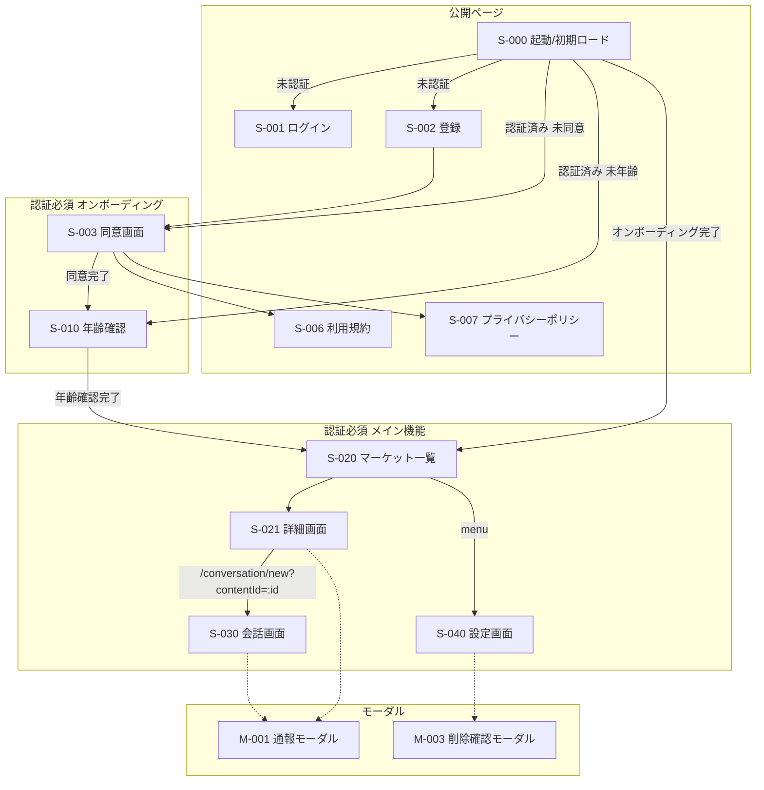
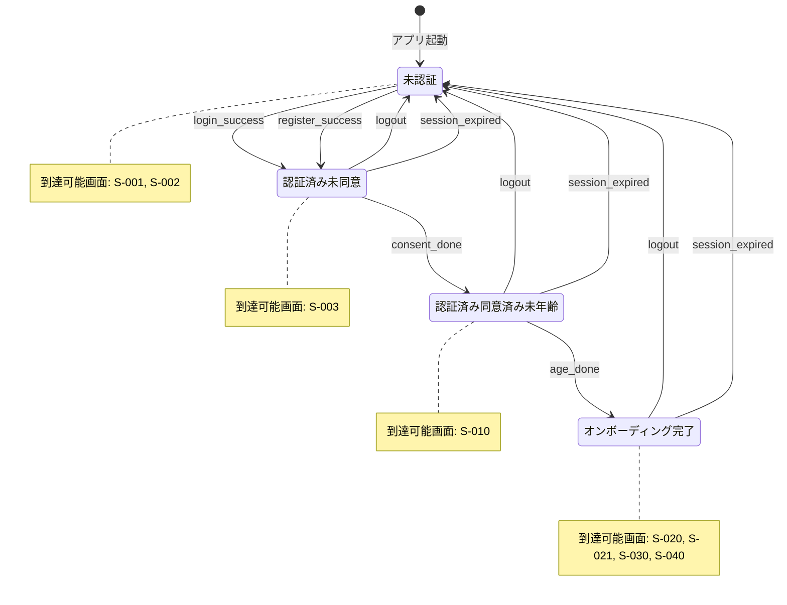

# AI will 画面設計書

このドキュメントは AI will の画面設計を定義します。

- 画面一覧（v5）
- 画面遷移図
- アクセス権限マトリックス（v1.2）
- ルーティング一覧（v1.2）

---

## 1. 画面一覧

### 1.1 公開ページ（認証不要）

| 画面ID | 画面名 | ルート | 説明 | Phase |
|--------|--------|--------|------|-------|
| S-000 | 起動/初期ロード | `/` | /me で状態判定後リダイレクト | 1 |
| S-001 | ログイン | `/login` | メール+パスワードログイン | 1 |
| S-002 | 登録 | `/register` | メール+パスワード登録 | 1 |
| S-004 | パスワードリセット要求 | `/password/forgot` | パスワードリセットメール送信 | 2 |
| S-005 | パスワード再設定 | `/password/reset` | トークン付きリンクから遷移 | 2 |
| S-006 | 利用規約（閲覧） | `/terms` | 常時閲覧可。同意画面からリンク | 1 |
| S-007 | プライバシーポリシー（閲覧） | `/privacy` | 常時閲覧可。同意画面からリンク | 1 |
| S-008 | メール認証結果 | `/verify-email` | トークン検証結果表示 | 2 |

### 1.2 オンボーディング（認証必須）

| 画面ID | 画面名 | ルート | 説明 | Phase |
|--------|--------|--------|------|-------|
| S-003 | 同意画面 | `/onboarding/consent` | 利用規約・プライバシーポリシー同意 | 1 |
| S-010 | 年齢確認 | `/onboarding/age` | 生年月日/年齢帯入力 | 1 |

### 1.3 メイン機能（認証必須・オンボーディング完了）

| 画面ID | 画面名 | ルート | 説明 | Phase |
|--------|--------|--------|------|-------|
| S-020 | マーケット一覧 | `/marketplace` | ホーム画面。Persona/Scenario一覧 | 1 |
| S-021 | 詳細画面 | `/marketplace/:id` | Persona/Scenarioの詳細表示 | 1 |
| S-030 | 会話画面（既存） | `/conversation/:threadId` | 既存スレッド再開 | 1 |
| S-030 | 会話画面（新規） | `/conversation/new?contentId=:id` | 新規会話開始。contentId必須 | 1 |
| S-031 | スレッド一覧 | `/conversations` | 複数スレッドの切り替え・再開 | 2 |
| S-040 | 設定 | `/settings` | アカウント設定、削除導線 | 1 |
| S-041 | ブロック管理 | `/settings/blocks` | ブロック一覧・解除 | 2 |
| S-042 | エクスポート | `/settings/export` | データエクスポート | 3 |
| S-050 | メモリー一覧 | `/memories` | 保存されたメモリーの閲覧・削除 | 2 |

### 1.4 モーダル（URLなし）

| 画面ID | 画面名 | 起動元 | 説明 | Phase |
|--------|--------|--------|------|-------|
| M-001 | 通報モーダル | S-021, S-030 | コンテンツ/会話の通報 | 1 |
| M-002 | 購入確認モーダル | S-021 | 有料コンテンツ購入確認 | 2 |
| M-003 | 削除確認モーダル | S-040 | アカウント/データ削除確認 | 1 |

### 1.5 サマリー

| 区分 | 画面数 | Phase1 | Phase2 | Phase3 |
|------|--------|--------|--------|--------|
| 公開ページ | 8 | 5 | 3 | 0 |
| オンボーディング | 2 | 2 | 0 | 0 |
| メイン機能 | 9 | 5 | 3 | 1 |
| モーダル | 3 | 2 | 1 | 0 |
| **合計** | **22** | **14** | **7** | **1** |

---

## 2. 画面遷移図

### 2.1 全体遷移図（Phase1+2+3）



### 2.2 Phase1のみ遷移図



### 2.3 ユーザー状態遷移図



---

## 3. アクセス権限マトリックス

### 3.1 公開ページ

| 画面ID | ルート | Guest | AuthNoConsent | AuthNoAge | Completed | ガード | 備考 |
|--------|--------|-------|---------------|-----------|-----------|--------|------|
| S-000 | `/` | ALLOW | ALLOW | ALLOW | ALLOW | — | 状態判定後リダイレクト |
| S-001 | `/login` | ALLOW | REDIRECT | REDIRECT | REDIRECT | `publicOnly` | 認証済み→状態に応じてリダイレクト |
| S-002 | `/register` | ALLOW | REDIRECT | REDIRECT | REDIRECT | `publicOnly` | 認証済み→状態に応じてリダイレクト |
| S-004 | `/password/forgot` | ALLOW | REDIRECT | REDIRECT | REDIRECT | `publicOnly`, `featureFlag:passwordReset` | Phase2 |
| S-005 | `/password/reset` | ALLOW | REDIRECT | REDIRECT | REDIRECT | `publicOnly`, `featureFlag:passwordReset` | Phase2 |
| S-006 | `/terms` | ALLOW | ALLOW | ALLOW | ALLOW | — | 常時閲覧可 |
| S-007 | `/privacy` | ALLOW | ALLOW | ALLOW | ALLOW | — | 常時閲覧可 |
| S-008 | `/verify-email` | ALLOW | ALLOW | ALLOW | ALLOW | `featureFlag:emailVerification` | Phase2 |

**リダイレクト先（publicOnly）:**
- AuthNoConsent → `/onboarding/consent`
- AuthNoAge → `/onboarding/age`
- Completed → `/marketplace`

### 3.2 オンボーディング

| 画面ID | ルート | Guest | AuthNoConsent | AuthNoAge | Completed | ガード | 備考 |
|--------|--------|-------|---------------|-----------|-----------|--------|------|
| S-003 | `/onboarding/consent` | REDIRECT→`/login` | ALLOW | REDIRECT→`/onboarding/age` | REDIRECT→`/marketplace` | `requireAuth` | 同意済みは画面内で状態判定 |
| S-010 | `/onboarding/age` | REDIRECT→`/login` | REDIRECT→`/onboarding/consent` | ALLOW | REDIRECT→`/marketplace` | `requireAuth`, `requireConsent` | |

### 3.3 メイン機能

| 画面ID | ルート | Guest | AuthNoConsent | AuthNoAge | Completed | ガード | 備考 |
|--------|--------|-------|---------------|-----------|-----------|--------|------|
| S-020 | `/marketplace` | REDIRECT | REDIRECT | REDIRECT | ALLOW | `requireCompleted` | ホーム画面 |
| S-021 | `/marketplace/:id` | REDIRECT | REDIRECT | REDIRECT | ALLOW | `requireCompleted` | |
| S-030 | `/conversation/:threadId` | REDIRECT | REDIRECT | REDIRECT | ALLOW | `requireCompleted` | 既存スレッド |
| S-030 | `/conversation/new` | REDIRECT | REDIRECT | REDIRECT | ALLOW | `requireCompleted` | 新規。contentId必須 |
| S-031 | `/conversations` | REDIRECT | REDIRECT | REDIRECT | ALLOW(flag) | `requireCompleted`, `featureFlag:threads` | Phase2 |
| S-040 | `/settings` | REDIRECT | REDIRECT | REDIRECT | ALLOW | `requireCompleted` | |
| S-041 | `/settings/blocks` | REDIRECT | REDIRECT | REDIRECT | ALLOW(flag) | `requireCompleted`, `featureFlag:blocks` | Phase2 |
| S-042 | `/settings/export` | REDIRECT | REDIRECT | REDIRECT | ALLOW(flag) | `requireCompleted`, `featureFlag:export` | Phase3 |
| S-050 | `/memories` | REDIRECT | REDIRECT | REDIRECT | ALLOW(flag) | `requireCompleted`, `featureFlag:memories` | Phase2 |

**リダイレクト先（requireCompleted）:**
- Guest → `/login`
- AuthNoConsent → `/onboarding/consent`
- AuthNoAge → `/onboarding/age`

### 3.4 モーダル

| 画面ID | 画面名 | 起動元 | Completed | 追加条件 | 備考 |
|--------|--------|--------|-----------|----------|------|
| M-001 | 通報モーダル | S-021, S-030 | ALLOW | — | 起動元が許可されていれば可 |
| M-002 | 購入確認モーダル | S-021 | ALLOW(flag) | `featureFlag:commerce` | Phase2 |
| M-003 | 削除確認モーダル | S-040 | ALLOW | — | |

---

## 4. ルーティング一覧

### 4.1 ルート定義

#### 公開ページ

| 画面ID | 画面名 | パス | メソッド | ルート名 | ガード | feature flag | 備考 |
|--------|--------|------|----------|----------|--------|--------------|------|
| S-000 | 起動/初期ロード | `/` | GET | `splash` | — | — | /me で状態判定 |
| S-001 | ログイン | `/login` | GET | `login` | `publicOnly` | — | |
| S-002 | 登録 | `/register` | GET | `register` | `publicOnly` | — | |
| S-004 | パスワードリセット要求 | `/password/forgot` | GET | `passwordForgot` | `publicOnly`, `featureFlag:passwordReset` | `passwordReset` | Phase2 |
| S-005 | パスワード再設定 | `/password/reset` | GET | `passwordReset` | `publicOnly`, `featureFlag:passwordReset` | `passwordReset` | Phase2 |
| S-006 | 利用規約 | `/terms` | GET | `terms` | — | — | |
| S-007 | プライバシーポリシー | `/privacy` | GET | `privacy` | — | — | |
| S-008 | メール認証結果 | `/verify-email` | GET | `verifyEmail` | `featureFlag:emailVerification` | `emailVerification` | Phase2 |

#### オンボーディング

| 画面ID | 画面名 | パス | メソッド | ルート名 | ガード | feature flag | 備考 |
|--------|--------|------|----------|----------|--------|--------------|------|
| S-003 | 同意画面 | `/onboarding/consent` | GET | `onboardingConsent` | `requireAuth` | — | 同意済み→リダイレクト |
| S-010 | 年齢確認 | `/onboarding/age` | GET | `onboardingAge` | `requireAuth`, `requireConsent` | — | |

#### メイン機能

| 画面ID | 画面名 | パス | メソッド | ルート名 | ガード | feature flag | 備考 |
|--------|--------|------|----------|----------|--------|--------------|------|
| S-020 | マーケット一覧 | `/marketplace` | GET | `marketplace` | `requireCompleted` | — | ホーム |
| S-021 | 詳細画面 | `/marketplace/:id` | GET | `marketplaceDetail` | `requireCompleted` | — | |
| S-030 | 会話（既存） | `/conversation/:threadId` | GET | `conversation` | `requireCompleted` | — | |
| S-030 | 会話（新規） | `/conversation/new` | GET | `conversationNew` | `requireCompleted` | — | **contentId必須** |
| S-031 | スレッド一覧 | `/conversations` | GET | `conversations` | `requireCompleted`, `featureFlag:threads` | `threads` | Phase2 |
| S-040 | 設定 | `/settings` | GET | `settings` | `requireCompleted` | — | |
| S-041 | ブロック管理 | `/settings/blocks` | GET | `settingsBlocks` | `requireCompleted`, `featureFlag:blocks` | `blocks` | Phase2 |
| S-042 | エクスポート | `/settings/export` | GET | `settingsExport` | `requireCompleted`, `featureFlag:export` | `export` | Phase3 |
| S-050 | メモリー一覧 | `/memories` | GET | `memories` | `requireCompleted`, `featureFlag:memories` | `memories` | Phase2 |

#### モーダル（URLなし）

| 画面ID | 画面名 | ルート名 | 起動元 | feature flag | 備考 |
|--------|--------|----------|--------|--------------|------|
| M-001 | 通報モーダル | `modalReport` | S-021, S-030 | — | |
| M-002 | 購入確認モーダル | `modalPurchase` | S-021 | `commerce` | Phase2 |
| M-003 | 削除確認モーダル | `modalDelete` | S-040 | — | |

### 4.2 リダイレクトルール

**評価順序：状態系ガード → publicOnly → featureFlag**

```
1. 未認証 && 認証必須ルート
   → /login

2. 認証済み && 未同意 && (requireConsent または requireCompleted)
   → /onboarding/consent

3. 認証済み && 同意済み && 未年齢 && (requireAge または requireCompleted)
   → /onboarding/age

4. Completed && publicOnly ルート
   → /marketplace

5. featureFlag 無効
   → /marketplace
```

### 4.3 ガード関数一覧

| ガード名 | 役割 |
|----------|------|
| `publicOnly` | 認証済みなら状態に応じてリダイレクト |
| `requireAuth` | 未認証→`/login` |
| `requireConsent` | 未同意→`/onboarding/consent` |
| `requireAge` | 未年齢→`/onboarding/age` |
| `requireCompleted` | auth + consent + age の合成 |
| `featureFlag:xxx` | 機能フラグ無効→`/marketplace` |

### 4.4 Feature Flag 一覧

| フラグ名 | 対象ルート/モーダル | Phase |
|----------|---------------------|-------|
| `passwordReset` | `/password/forgot`, `/password/reset` | 2 |
| `emailVerification` | `/verify-email` | 2 |
| `threads` | `/conversations` | 2 |
| `blocks` | `/settings/blocks` | 2 |
| `memories` | `/memories` | 2 |
| `commerce` | M-002 | 2 |
| `export` | `/settings/export` | 3 |

### 4.5 ルート定義（TypeScript）

```typescript
export const routes = [
  // === 公開ページ ===
  { path: '/',                name: 'splash',            guards: [] },
  { path: '/login',           name: 'login',             guards: ['publicOnly'] },
  { path: '/register',        name: 'register',          guards: ['publicOnly'] },
  { path: '/password/forgot', name: 'passwordForgot',    guards: ['publicOnly', 'featureFlag:passwordReset'] },
  { path: '/password/reset',  name: 'passwordReset',     guards: ['publicOnly', 'featureFlag:passwordReset'] },
  { path: '/terms',           name: 'terms',             guards: [] },
  { path: '/privacy',         name: 'privacy',           guards: [] },
  { path: '/verify-email',    name: 'verifyEmail',       guards: ['featureFlag:emailVerification'] },

  // === オンボーディング ===
  { path: '/onboarding/consent', name: 'onboardingConsent', guards: ['requireAuth'] },
  { path: '/onboarding/age',     name: 'onboardingAge',     guards: ['requireAuth', 'requireConsent'] },

  // === メイン機能 ===
  { path: '/marketplace',            name: 'marketplace',       guards: ['requireCompleted'] },
  { path: '/marketplace/:id',        name: 'marketplaceDetail', guards: ['requireCompleted'] },
  { path: '/conversation/new',       name: 'conversationNew',   guards: ['requireCompleted'] },
  { path: '/conversation/:threadId', name: 'conversation',      guards: ['requireCompleted'] },
  { path: '/conversations',          name: 'conversations',     guards: ['requireCompleted', 'featureFlag:threads'] },
  { path: '/settings',               name: 'settings',          guards: ['requireCompleted'] },
  { path: '/settings/blocks',        name: 'settingsBlocks',    guards: ['requireCompleted', 'featureFlag:blocks'] },
  { path: '/settings/export',        name: 'settingsExport',    guards: ['requireCompleted', 'featureFlag:export'] },
  { path: '/memories',               name: 'memories',          guards: ['requireCompleted', 'featureFlag:memories'] },
] as const;
```

### 4.6 サマリー

#### ルート数（区分別）

| 区分 | ルート数 | 内訳 |
|------|----------|------|
| 公開（ガードなし） | 3 | `/`, `/terms`, `/privacy` |
| 公開（publicOnly） | 4 | `/login`, `/register`, `/password/forgot`, `/password/reset` |
| 公開（featureFlagのみ） | 1 | `/verify-email` |
| オンボーディング | 2 | `/onboarding/consent`, `/onboarding/age` |
| メイン（requireCompleted） | 9 | `/marketplace`, `/marketplace/:id`, `/conversation/new`, `/conversation/:threadId`, `/conversations`, `/settings`, `/settings/blocks`, `/settings/export`, `/memories` |
| **ルート合計** | **19** | |
| モーダル（URLなし） | 3 | M-001, M-002, M-003 |
| **全体合計** | **22** | |

#### Phase別ルート数

| Phase | ルート数 | 内訳 |
|-------|----------|------|
| Phase1 | 12 | `/`, `/login`, `/register`, `/terms`, `/privacy`, `/onboarding/consent`, `/onboarding/age`, `/marketplace`, `/marketplace/:id`, `/conversation/new`, `/conversation/:threadId`, `/settings` |
| Phase2 | 6 | `/password/forgot`, `/password/reset`, `/verify-email`, `/conversations`, `/settings/blocks`, `/memories` |
| Phase3 | 1 | `/settings/export` |

#### Phase別モーダル

| Phase | モーダル | 内訳 |
|-------|----------|------|
| Phase1 | 2 | M-001, M-003 |
| Phase2 | 1 | M-002 |
| Phase3 | 0 | — |

---

## 変更履歴

| バージョン | 日付 | 変更内容 |
|------------|------|----------|
| v1 | 2026-01-31 | 初版作成（画面一覧v5 + 遷移図 + アクセス権限v1.2 + ルーティングv1.2 を統合） |
